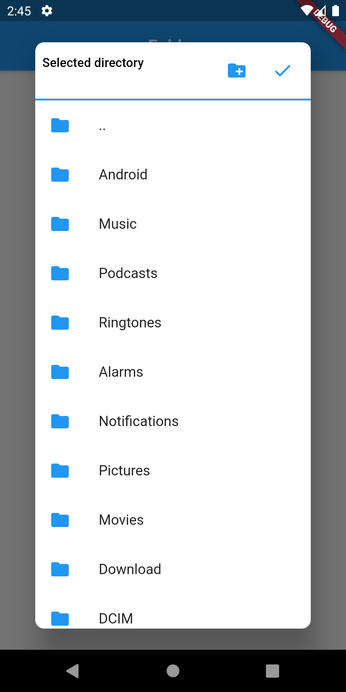
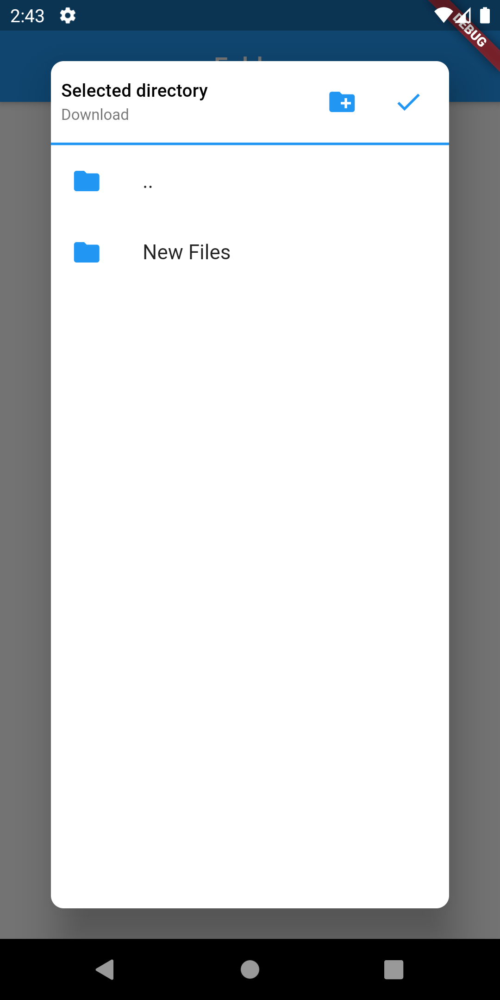

# easy_folder_picker

Easy directory picker for Flutter  

[](https://pub.dev/packages/easy_folder_picker)

A flutter package to pick directories and handles requesting required permissions as well. This package only supports android.




## Installation

Add below line to your `pubspec.yaml` and run `flutter packages get`
```
  easy_folder_picker: ^0.0.1
```

> **NOTE:** As of version 1.0.0 this plugin switched to the AndroidX version of the Android Support Libraries. This means you need to make sure your Android project is also upgraded to support AndroidX. Detailed instructions can be found [here](https://flutter.dev/docs/development/packages-and-plugins/androidx-compatibility). Use version 0.2.2 if you do not want to use AndroidX(not recommended) for your project.
>
>The TL;DR version is:
>
>1. Add the following to your "gradle.properties" file:
>
>```
>android.useAndroidX=true
>android.enableJetifier=true
>```
>2. Make sure you set the `compileSdkVersion` in your "android/app/build.gradle" file to 28:
>
>```
>android {
>  compileSdkVersion 28
>
>  ...
>}
>```
>3. Make sure you replace all the `android.` dependencies to their AndroidX counterparts (a full list can be found here: https://developer.android.com/jetpack/androidx/migrate).

## Permissions
Add below line to your `android/app/src/main/AndroidManifest.xml`
```
<uses-permission android:name="android.permission.READ_EXTERNAL_STORAGE" />
```
If you want to allow creating new folders directly from picker then add the below permission also
```
<uses-permission android:name="android.permission.WRITE_EXTERNAL_STORAGE" />
```

## Usage
```
import 'package:directory_picker/directory_picker.dart';
import 'package:path_provider/path_provider.dart';

// In any callback call the below method
Directory newaDirectory = await DirectoryPicker.pick(
  context: context,
  rootDirectory: directory
);

if (newDirectory != null) {
  // Do something with the picked directory
} else {
  // User cancelled without picking any directory
}
```
